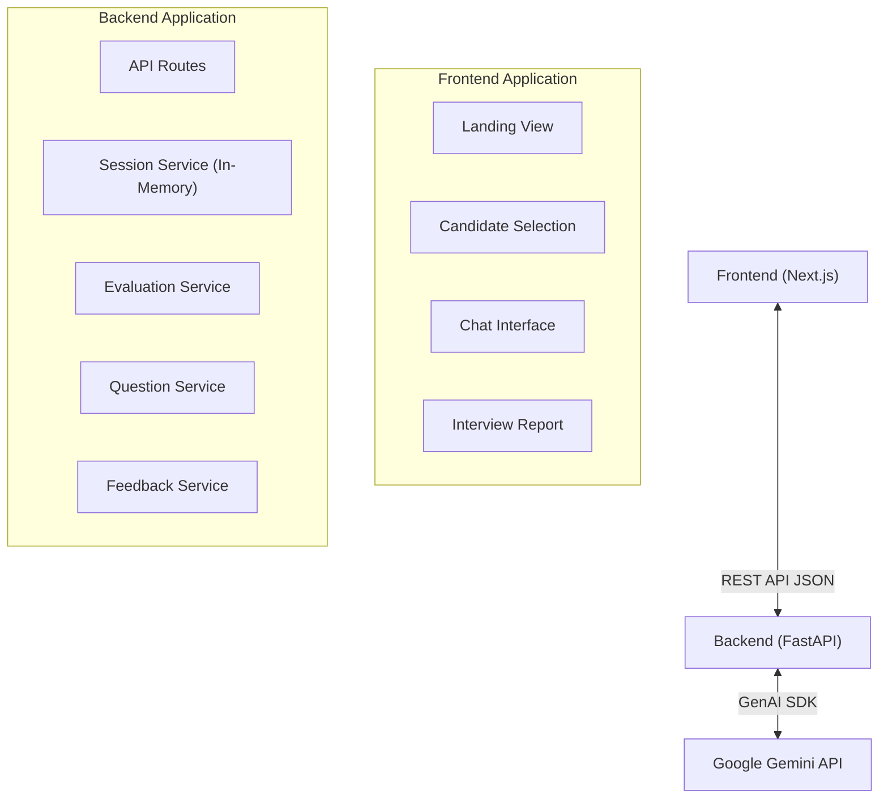

# AI Interview Agent - System Architecture

This document provides a high-level overview of the system architecture for the AI Interview Agent project. The project is a full-stack web application designed to conduct automated technical interviews using generative AI.

## High-Level Architecture

The system follows a classic client-server architecture with an external dependency on an LLM API:

1. **Frontend (Client)**: A Next.js (React) application that provides the user interface for the candidate to interact with the AI interviewer.
2. **Backend (Server)**: A FastAPI (Python) application that manages interview sessions, handles business logic, and communicates with the LLM.
3. **LLM Provider**: Google GenAI API (using the `gemini-3.5-flash-lite` model) which powers the core intelligence for generating questions and evaluating answers.

---

## 1. Frontend (Next.js)

The frontend is built with modern React features using Next.js. It is styled with **Tailwind CSS** and utilizes UI components from **shadcn/ui**.

**Key Components (`frontend/components/interviewer/`):**
- **`interviewer-app.tsx`**: The main orchestrator that manages the state transitions between different views.
- **`landing-view.tsx`**: The entry point for the user.
- **`selection-view.tsx`**: Interface for selecting or inputting candidate profile details.
- **`chat-view.tsx`**: The primary conversational interface where the candidate interacts with the AI.
- **`report-view.tsx`**: Displays the final feedback and evaluation after the interview concludes.

---

## 2. Backend (FastAPI)

The backend is a stateless-style REST API, though it maintains interview progress in an in-memory database.

**Core Routes (`backend/app/routes/`):**
- `POST /api/interview`: The single endpoint that handles both starting a new interview and continuing an ongoing one based on the request payload.

**Services (`backend/app/services/`):**
- **`session_service.py`**: Manages the state of active interviews in memory (using a Python dictionary). It tracks the question count, conversation history, and topics covered for a given `session_id`.
- **`candidate_service.py`**: Analyzes the candidate's profile to tailor the interview.
- **`question_service.py`**: Interacts with the LLM to generate context-aware questions based on the candidate's role, previous answers, and covered topics.
- **`evaluation_service.py`**: Uses the LLM to analyze the candidate's responses. It categorizes answers into ratings (e.g., "good", "poor", "invalid", "clarify", "dont_know") and handles edge cases like gibberish or requests for clarification.
- **`feedback_service.py`**: Compiles the entire Q&A log into a comprehensive final report once the interview ends.

---

## 3. Interview Flow & Logic

The system features "Smart Termination" logic to determine when an interview should end:

1. **Initialization**: The frontend sends the candidate profile. The backend analyzes it, generates the first question, creates a session, and returns the question.
2. **Q&A Loop**: 
   - The candidate submits an answer.
   - `evaluation_service.py` grades the answer. If the answer is gibberish, it prompts the user to clarify without incrementing the question count.
   - If valid, the answer is logged, and the question count increments.
3. **Termination Check**: 
   - **Minimum Questions**: The interview will never end before 8 questions.
   - **Maximum Questions**: The interview will always end at 12 questions.
   - **Between 8-12**: If the candidate is performing poorly, it stops early. If they are performing very well, it continues to explore deeper. If mixed, it stops at 10.
4. **Conclusion**: Once the termination criteria are met, `feedback_service.py` runs and the frontend transitions to the `report-view.tsx`.
